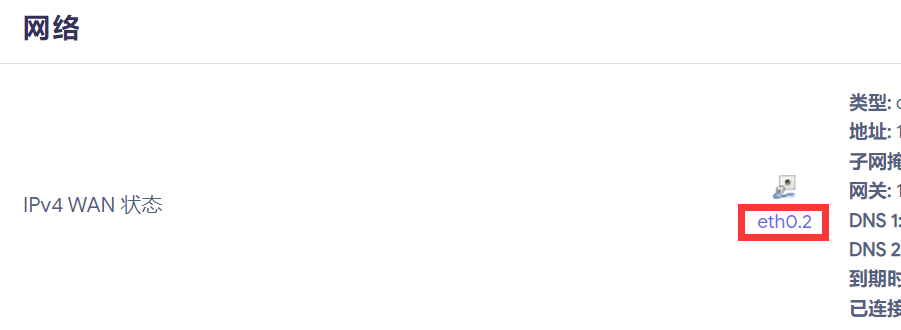

# NJUPT_AutoLogin

南京邮电大学校园网自动登录脚本，支持 macOS 、 Linux（如 OpenWRT）和 MikroTik RouterOS 平台。**欢迎提交 Issue 和 PR，一起完善这个脚本。**

适用于 MikroTik RouterOS 平台的使用教程请 [移步这里](./README_RouterOS.md)

## 使用方法

1. 下载该脚本（`NJUPT-AutoLogin.sh`）；
2. 按照下面的选项和参数表构造运行命令。
   一般格式：`bash NJUPT-AutoLogin.sh [-i interface] [-o operator] [-t timeout] [-p ipv4_addr] [-m] [-n] [-h] login_id login_password`
   例如：`bash NJUPT-AutoLogin.sh -i en0 -o ctcc -t 2 B21012250 12345678`
3. 如果是在 OpenWRT 路由器平台上运行，可以参考 [在 OpenWRT 上运行](#在-openwrt-上运行)

选项表：

| 选项 | 名称                   | 默认值       | 备注                                                                       |
| ---- | ---------------------- | ------------ | -------------------------------------------------------------------------- |
| `-i` | interface 接口         | `en0`        | 原来的 `-e` 参数                                                           |
| `-o` | operator 运营商        | `ctcc`       | 原来的 `-i` 参数：取值可能有三种，校园网为 njupt，电信为 ctcc，移动为 cmcc |
| `-t` | timeout 超时时间       | `2`          | 用于指定检查网络连通性时的超时时间                                         |
| `-p` | ipv4_addr IPv4 地址    | （自动检测） | 用于手动指定 IPv4 地址，默认情况下会自动检测本机 IP                        |
| `-m` | logout_mode 登出模式   | -            | 原来的 `-o` 参数：切换到登出模式，脚本运行会登出校园网                     |
| `-n` | not_limited 无限制账号 | -            | 切换到无时间限制账号，所有时间都会尝试登录                                 |
| `-h` | 显示帮助菜单           | -            |                                                                            |

参数表：

| 参数             | 名称       |
| ---------------- | ---------- |
| `login_id`       | 登录用户名 |
| `login_password` | 登录密码   |

> [!IMPORTANT]
>
> `login_password` 中的特殊字符可能需要转义，如：`+` 可能需要写为 `%2B`，`&` 可能需要写为 `%26`。
>
> 这是理论上的，未经过实际的测试。

已弃用选项表：

| 参数 | 名称                     | 默认值 | 备注                                         |
| ---- | ------------------------ | ------ | -------------------------------------------- |
| -s   | 标记当前位置为三牌楼校区 | -      | ~~三牌楼校区须加上，仙林校区不用~~（已失效） |
| -d   | 忽略未插入网线的错误     | -      | ~~配置单线多拨时须加上~~（已失效）           |

> [!TIP]
> 思路及更详细的教程请移步 [Nuotian 的博客](https://nuotian.furry.pro/blog/archives/204#header-id-4)。

> [!WARNING]
> 脚本会获取系统时间来判断当前时间是否是可上网时间，进而判断是否要尝试登录，所以错误的系统时间可能导致脚本无法正常运行。建议首先校准系统时间。

> [!CAUTION]
> **2023 年 7 月更新：目前还不知道三牌楼校区的新接口有什么变化，如果不能正常登录请提交 Issue。**

## 更新日志

- 2024.04.17 重构；添加对 macOS 的支持
- 2023.07.23 适配 23 年 7 月更新的校园网接口
- 2022.09.02 添加对多网卡设备的支持
- 2022.08.31 适配三牌楼校区
- 2022.08.31 添加对不断网账号的支持

更多请见 [Releases](https://github.com/s235784/NJUPT_AutoLogin/releases)。

## 在 OpenWRT 上运行

下载 [Releases](https://github.com/s235784/NJUPT_AutoLogin/releases) 中的脚本，上传到路由器中。

进入路由器后台，记住首页出现的 **IPv4 WAN 状态** 中的 **eth0.x**，例如我这里是 `eth0.2`。



在路由器的计划任务中添加以下命令，并根据实际情况修改这条命令：

```crontab
*/5 * * * * bash /path/to/your/NJUPT-AutoLogin.sh [-i interface] [-o operator] [-t timeout] [-p ipv4_addr] [-m] [-n] [-h] login_id login_password
```

完整的命令如图（复杂的密码请用 `"` 括起来）


确认无误后保存。之后路由器就会每 5 分钟确认一次网络状态，如果允许登录时间内没有登录校园网，路由器就会自动尝试登录了。

## 进阶用法

- [南邮校园网单线多拨](https://nuotian.furry.pro/blog/archives/347)（部分寝室有效，需要更多反馈 [#11](https://github.com/s235784/NJUPT_AutoLogin/issues/11)）

## 参考

- [南京邮电大学*校园网/电信宽带/移动宽带*路由器共享 WiFi + 自动认证](https://github.com/kaijianyi/NJUPT_NET)
- [校园网自动登录全平台解决方案](https://zhuanlan.zhihu.com/p/364016452)

## License

```license
 Copyright 2021, NuoTian

   Licensed under the Apache License, Version 2.0 (the "License");
   you may not use this file except in compliance with the License.
   You may obtain a copy of the License at

       http://www.apache.org/licenses/LICENSE-2.0

   Unless required by applicable law or agreed to in writing, software
   distributed under the License is distributed on an "AS IS" BASIS,
   WITHOUT WARRANTIES OR CONDITIONS OF ANY KIND, either express or implied.
   See the License for the specific language governing permissions and
   limitations under the License.
```
